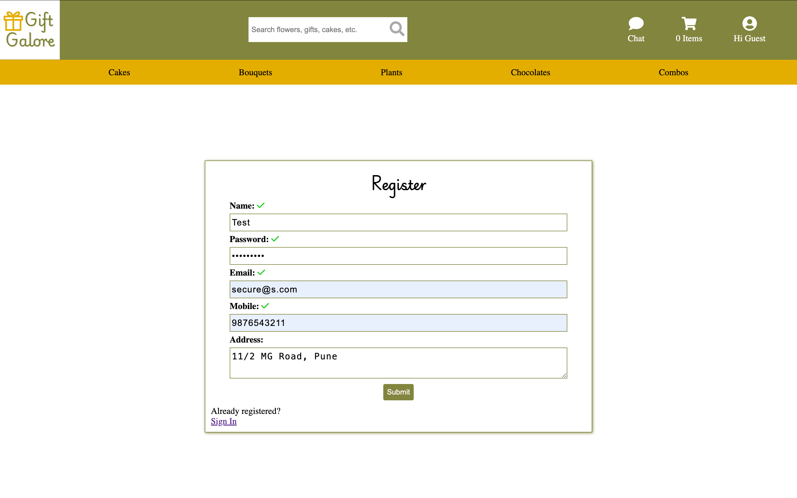
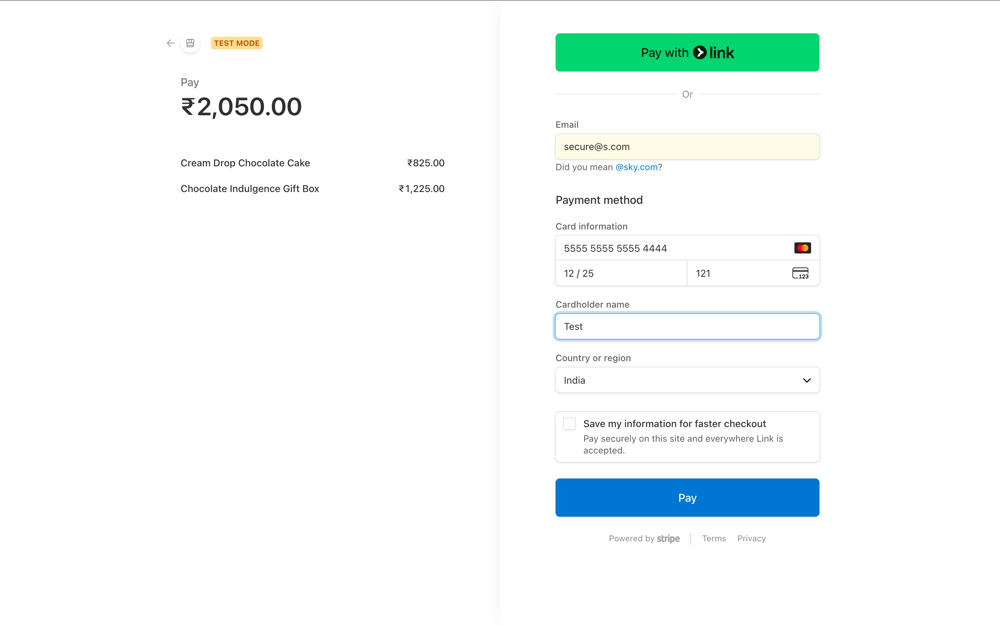
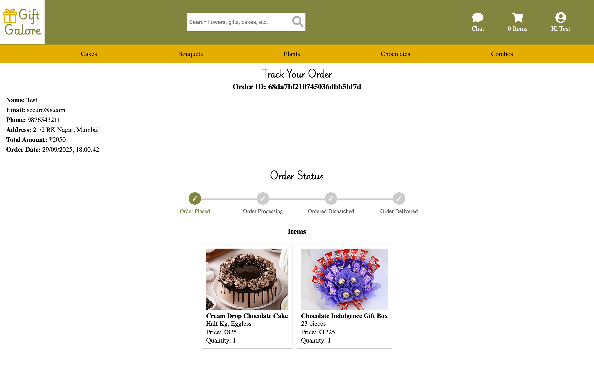
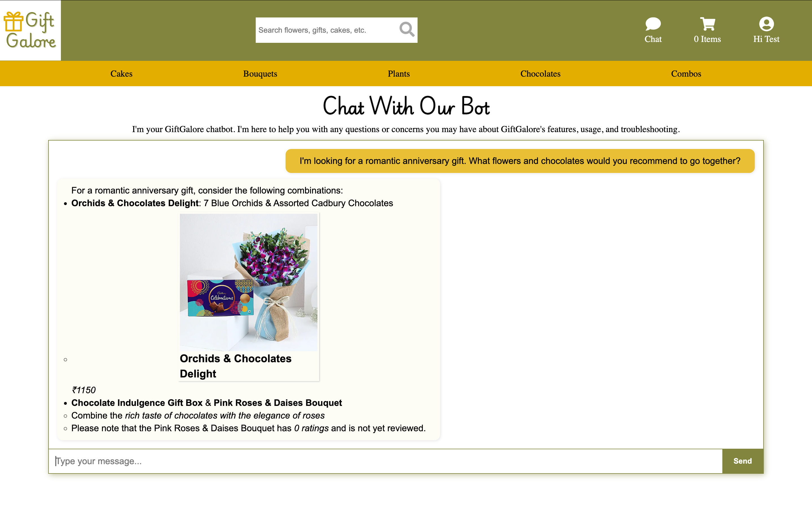

# Gift Galore

MERN-based ML-Enhanced E-Commerce Platform for Gifting Products

## Overview

Gift Galore is a **full-stack e-commerce platform** built with the **MERN stack**, designed for a personalized and seamless gifting experience. The platform integrates **machine learning** and **AI-powered features** to enhance user experience, optimize business insights, and provide intelligent product recommendations.

This project is developed to showcase how **cutting-edge technology** can transform traditional e-commerce into an **intelligent, data-driven marketplace**.

## Features

### Core E-Commerce Features

- **User Authentication & Authorization:** Secure login and registration with JWT-based authentication with role-based access for **admins** and **users**.
- **Product Catalog:** Browse and search a wide range of gifting products.
- **Shopping Cart:** Add, remove, and update products easliy.
- **Order Management:** Place, track, and manage orders with real-time status updates
- **Payment Integration:** Stripe integration for secure online payments.
- **Automated email notifications:** Scheduled notifications using Node-Cron.

### AI & ML Enhancements

- **AI Chatbot (Groq’s LLaMA 3 + RAG):** Personalized customer support powered by Retrieval-Augmented Generation.
- **Market Basket Analysis (Apriori):** Recommends frequently bought-together items.
- **Sentiment analysis:** Summarizes product reviews to highlight customer feedback.
- **Collaborative Filtering:** Suggests products purchased by similar users.

### Admin dashboard

- Visualizes daily, monthly, and yearly sales trends.
- Displays category-wise sales distribution.
- Shows revenue growth over time.
- Provides order status breakdown with pie charts.
- Tracks average order value.
- Analyzes customer churn trends.
- Highlights top products for the last 3 months and provides forecasts for the next month.
- Performs customer segmentation using RFM (Recency, Frequency, Monetary) analysis.

### UI/UX

- Fully Responsive, mobile-first design.
- Clean, modern, and intuitive interface.
- Best-seller tags based on product performance metrics.

## Tech Stack

- **Frontend:** React.js, CSS3, HTML5
- **Backend:** Node.js, Express.js
- **Database:** MongoDB with Mongoose
- **Authentication:** JSON Web Tokens (JWT)
- **Payments:** Stripe API
- **Media Storage:** Cloudinary for storing and serving user-uploaded images
- **Machine Learning:** Python
- **Chatbot:** Groq’s LLaMA 3 integrated with Node backend
- **Other Tools:** Node-Cron for scheduled tasks

## Screenshots

### Home Page

### Sign Up

### Browsing

### Shopping Cart

### Payment

###

### Order Tracking

### Personalized Recommendations

[!Personalized Recommendations](Screenshots/PersonalizedRecommendations.png)

### Admin Dashboard

### Product Analytics

### Order Analytics

### Market Basket Analysis

### Churn Trend & RFM Segmentation

### Chat Bot

## Demo

### Demo Video

- **Watch Demo:** https://www.youtube.com/watch?v=CoCag3RKzQg

### Live Deployment

- **Frontend:** Netlify
- **Backend:** Render
- **Website:** https://giftgalore.netlify.app/

### Demo Accounts

- Admin login:
  - Username: ABCD
  - Password: abc123ABC
- Test user:
  - Username: Test
  - Password: abc123ABC

### Stripe Test Payments

- Card Number: 5555 5555 5555 4444
- Expiry: Any future date
- CVC: Any 3-digit number
